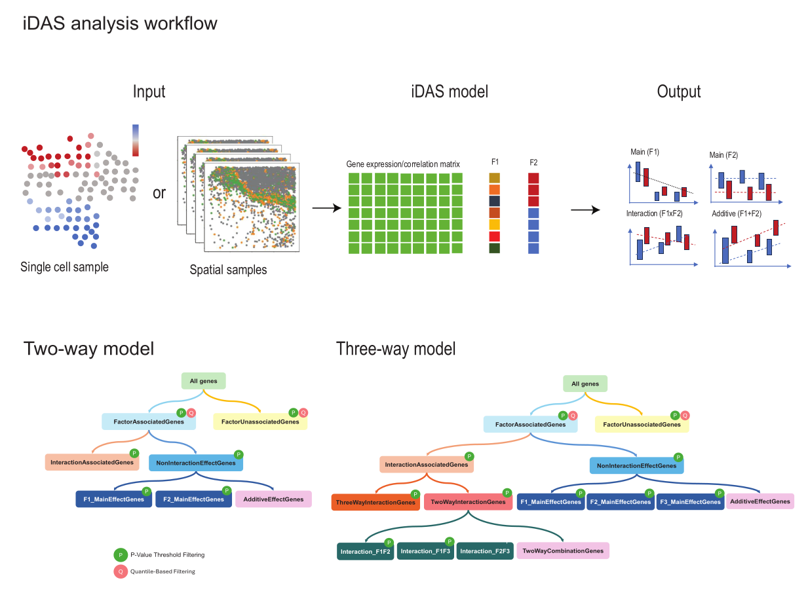

# iDAS: Interpretable Differential Abundance Signature

## Introduction

To better interpret the gene signatures generated in the differential
abundance analysis, we developed iDAS to group the gene signatures into
multiple categories.

We present a two-stage ANOVA-based post-DA model approach to improve
interpretation for perturbation studies, named interpretable
differential abundance signature (iDAS). As illustrated in Figure 1, for
a single-cell dataset with two phenotypes such as responding to
treatment, we begin with the output from any differential abundance
algorithm or sample based spatial gene analysis result. Examples
includes results from identify binary phenotype from Milo or nearest
neighborhood correlation of genes in spatial samples. Next we build on
two-way factorial experiments by jointly modeling cell-type (or
cell-state factor, F1 in Figure 1) and treatment phenotypes factor (F2
in Figure 1). We then applied the approach similar to NANOVA(Zhou and
Wong 2011), where we performed a series of “nested” ANOVA and used the
results between the different models to classify genes into different
categories relating to main and interaction effects. These groups
include the main effects for cell type (F1) and treatment phenotype
(F2), the interaction effect between cell type and phenotype (F1xF2),
the additive effect of cell type and phenotype (F1+F2), and a
non-significant group comprising genes not relevant to any of the main
factors.

*Figure 1. iDAS
workflow*

## iDAS functions

The iDAS package primarily provides functions to group genes based on
multiple-factor effects. This can be achieved using the iDAS() function.
We also provide dedicated functions for two-way and three-way analyses,
such as twofactors() and threefactors().

iDAS package allows users to apply either a linear regression model
using the [`lm()`](https://rdrr.io/r/stats/lm.html) function in
**stats** package or a linear mixed-effects model using the `lmer()`
function from the **lme4** package.

For all hypothesis tests, users can choose to use either raw p-values or
adjusted p-values cut off to identify whether a gene is associated with
a factor of interest. In the first step, where genes are classified as
associated or not associated with any factor, we also provide an option
to use a p-value quantile cutoff. This is a user-defined percentage
value that sets the significance threshold based on the distribution of
full model p-values or adjusted p-values (See Figure 1).

Here, we demostrate the functions using a simple simulation data.

### Two-way model

``` r
library(iDAS)
set.seed(42)

# 1. Simulate design: 2 factors, each with 2 levels
factor1 <- as.factor(rep(c("A", "B"), each = 5))         # 10 samples
factor2 <- as.factor(rep(c("X", "Y"), times = 5))        # alternate X/Y

# 2. Simulate gene expression: samples × genes (10 × 10)
Z <- matrix(rnorm(100, mean = 0, sd = 1), nrow = 10, ncol = 10)
colnames(Z) <- paste0("gene", 1:10)

# 3. Inject effects
# gene1: Factor1 main effect
Z[factor1 == "B", 1] <- Z[factor1 == "B", 1] + 4  
# gene2: Factor2 main effect
Z[factor2 == "Y", 2] <- Z[factor2 == "Y", 2] + 6  
# gene3: interaction
Z[factor1 == "B" & factor2 == "Y", 3] <- Z[factor1 == "B" & factor2 == "Y", 3] + 6 

# 4. Run iDAS (Z is already samples × genes, no need to transpose!)
result <- iDAS::iDAS(
    Z = Z,
    factor1 = factor1,
    factor2 = factor2,
    model_fit_function = "lm",
    test_function = "parametric",
    pval_cutoff_full = 0.05,
    pval_cutoff_interaction = 0.05,
    pval_cutoff_factor1 = 0.05,
    pval_cutoff_factor2 = 0.05
)
#> [1] "Running two-factor model"
#> [1] "full model"
#> [1] "interaction,f1,f2"

# 5. Check output
print(result$class_df)
#>        varname    Sig0     Sig1
#> gene1    gene1     sig Additive
#> gene2    gene2 non-sig     <NA>
#> gene3    gene3 non-sig     <NA>
#> gene4    gene4 non-sig     <NA>
#> gene5    gene5 non-sig     <NA>
#> gene6    gene6 non-sig     <NA>
#> gene7    gene7 non-sig     <NA>
#> gene8    gene8 non-sig     <NA>
#> gene9    gene9 non-sig     <NA>
#> gene10  gene10 non-sig     <NA>

# 6. (Optional) Add true labels to evaluate accuracy
true_labels <- rep("null", 10)
true_labels[1] <- "F1"
true_labels[2] <- "F2"
true_labels[3] <- "F1:F2"

result$class_df$Sig1[is.na(result$class_df$Sig1)]="null"
table(predicted = result$class_df$Sig1, truth = true_labels)
#>           truth
#> predicted  F1 F1:F2 F2 null
#>   Additive  1     0  0    0
#>   null      0     1  1    7
```

### Three-way model

``` r

set.seed(42)
Z <- matrix(rnorm(1000), ncol = 10)
colnames(Z)=paste0("gene",1:10)
factor1 <- as.factor(rep(1:2, each = 5))
factor2 <- as.factor(rep(1:2, times = 5))
factor3 <- as.factor(rep(1:2, length.out = 10))

# Run the differential analysis using iDAS
result <- iDAS::iDAS(
  Z, factor1, factor2, factor3,
  model_fit_function = "lm",
  test_function = "parametric",
  pval_quantile_cutoff = 0.02,
  pval_cutoff_full = 0.05,
  pval_cutoff_interaction = 0.01,
  pval_cutoff_factor1 = 0.01,
  pval_cutoff_factor2 = 0.01,
  pval_cutoff_factor3 = 0.01,
  pval_cutoff_int12 = 0.01,
  pval_cutoff_int13 = 0.01,
  pval_cutoff_int23 = 0.01,
  pval_cutoff_int123 = 0.01
)
#> [1] "Running three-factor model"

# Inspect results
head(result$pval_matrix)
#>            Sig0 Intornotint F1 F2 F3 twowaysorthreeways F1F2 F2F3 F1F3
#> gene1 0.7628099          NA NA NA NA                 NA   NA   NA   NA
#> gene2 0.8770827          NA NA NA NA                 NA   NA   NA   NA
#> gene3 0.5928445          NA NA NA NA                 NA   NA   NA   NA
#> gene4 0.3284234          NA NA NA NA                 NA   NA   NA   NA
#> gene5 0.3128253          NA NA NA NA                 NA   NA   NA   NA
#> gene6 0.9778635          NA NA NA NA                 NA   NA   NA   NA
head(result$stat_matrix)
#>            Sig0 Intornotint F1 F2 F3 twowaysorthreeways F1F2 F2F3 F1F3
#> gene1 0.8735446          NA NA NA NA                 NA   NA   NA   NA
#> gene2 0.4732061          NA NA NA NA                 NA   NA   NA   NA
#> gene3 1.2488545          NA NA NA NA                 NA   NA   NA   NA
#> gene4 1.9206980          NA NA NA NA                 NA   NA   NA   NA
#> gene5 2.2148863          NA NA NA NA                 NA   NA   NA   NA
#> gene6 0.1834940          NA NA NA NA                 NA   NA   NA   NA
head(result$class_df)
#>   varname    Sig0 Sig1 notInt
#> 1   gene1 non-sig <NA>   <NA>
#> 2   gene2 non-sig <NA>   <NA>
#> 3   gene3 non-sig <NA>   <NA>
#> 4   gene4 non-sig <NA>   <NA>
#> 5   gene5 non-sig <NA>   <NA>
#> 6   gene6 non-sig <NA>   <NA>
```
